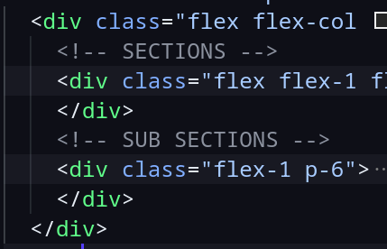

## Navbar content

### SDKs

you can find the SDKs content in the `./src/snippets/sdks.html`. This file is divided into 2 parts, SECTIONS and SUB SECTIONS as below:

### Resources

### Guides, Support ...

The other items behavior in the navbar is editable from the navbar object in the `docusaurus.config.js` file. You can find it in the line `116`

### Search

You can replace **ALGOLIA** credentials in the line `213` in the `docusaurus.config.js` file.

## Homepage content

### Hero

[Hero Json File](./src/data/hero.json)

### Pills

[SDKs Section Json File](./src/data/sdks.json)

### API Reference

[API Reference Json File](./src/data/api-reference.json)

### Resources

[Resources Json File](./src/data/resources.json)

### Cards _(Help Section)_

[Cards Json File](./src/data/help.json)

### Last Component _(Community Section)_

[Community Json File](./src/data/community.json)

### Footer

[Footer Json File](./src/data/footer.json)

## API Reference

### Postman Button

Replace the postmanUrl with your own Postman Run in Postman button URL in the `./src/components/RunInPostmanButton.tsx` file.

### Stoplight yaml files

Place your yaml files from stoplight in the `./static/api` folder.

## Versioning

[Docusaurus Documentation](https://docusaurus.io/docs/versioning)

## FAQ

Change the questions and answers in the `./src/faq.yaml` file.
